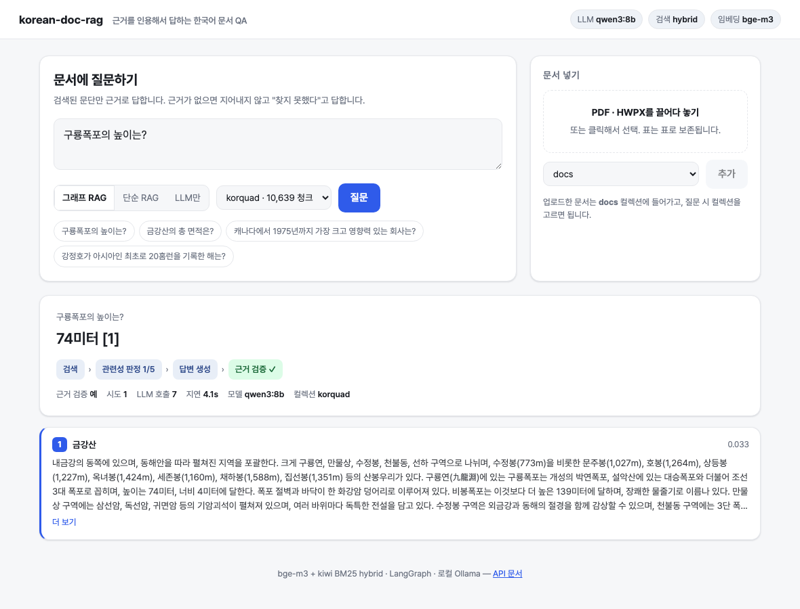

# korean-doc-rag

한국어 문서에 질문하면 **근거를 인용해서** 답하는 RAG 서비스.

```
Q: 5년 이상 근속하면 연차가 며칠인가?
A: 17일 [2]
   [2] sample_policy.hwpx §1  [표] | 근속연수 | 연차일수 | … | 5년 이상 | 17일 |
   path: retrieve → grade:2/4 → generate → verify:ok
```

- 검색은 **벡터(bge-m3) + 형태소 BM25(kiwi)** hybrid — 한국어 조사 때문에 형태소 분석이 없으면 recall이 16pp 빠진다
- 흐름은 **LangGraph**: 검색 → 관련성 판정 → (없으면 재검색) → 답변 → 근거 검증
- **로컬 모델(Ollama)로 API 키 없이** 돌아간다. Claude·OpenAI 호환 엔드포인트는 옵션
- PDF·HWPX를 넣을 수 있고, 표는 표로 보존된다

| KorQuAD 200문항, Qwen3 8B | EM | F1 |
|---|---|---|
| LLM만 | 0.045 | 0.263 |
| 단순 RAG | 0.720 | 0.840 |
| **그래프 RAG** | **0.725** | **0.860** |

왜 이런 숫자가 나왔는지, 무엇이 효과가 있었고 무엇이 없었는지는 [docs/evaluation.md](docs/evaluation.md).

## 시작하기

```bash
git clone https://github.com/nolnol3/korean-doc-rag && cd korean-doc-rag
make setup                      # uv venv + 의존성
ollama pull qwen3:8b            # 로컬 LLM
make fetch && make index        # KorQuAD 문단 10,639개 인덱싱 (Apple Silicon 약 10분)
make serve                      # http://localhost:8000
```

브라우저에서 `http://localhost:8000` — 질문창 하나. Swagger는 `/docs`.



## 쓰기

**API**

```bash
curl -X POST localhost:8000/ask -H 'content-type: application/json' \
     -d '{"q": "구룡폭포의 높이는?"}'
```

```json
{
  "answer": "74미터 [1]",
  "citations": [{"n": 1, "title": "금강산", "text": "내금강의 동쪽에 있으며, 동해안을 따라 펼쳐진 지역을 포괄한다. 크게 구…"}],
  "path": ["retrieve", "grade:1/5", "generate", "verify:ok"],
  "grounded": true
}
```

`mode`를 `naive`(단순 RAG)나 `none`(검색 없음)으로 주면 같은 질문을 다른 방식으로 답한다.

**내 문서 넣기** — PDF, HWPX

UI 오른쪽 "문서 넣기"에 끌어다 놓으면 파싱·임베딩 후 바로 질문할 수 있다. 같은 일을 API로:

```bash
curl -F files=@report.pdf -F files=@policy.hwpx -F collection=docs localhost:8000/upload
curl -X POST localhost:8000/ask -H 'content-type: application/json' \
     -d '{"q": "5년 이상 근속하면 연차가 며칠인가?", "collection": "docs"}'
```

대량이면 CLI: `COLLECTION=docs python -m kdr.ingest_docs ./my_docs/`. 자세한 건 [docs/documents.md](docs/documents.md).

**다른 LLM** — `.env`

```
LLM_PROVIDER=ollama          # ollama | anthropic | openai(호환 엔드포인트: vLLM, LiteLLM, 게이트웨이)
OLLAMA_MODEL=qwen3:8b
RETRIEVAL_MODE=hybrid        # hybrid | vector | bm25 | bm25_ws
```

Docker: `docker compose up` (호스트의 Ollama를 쓴다).

## 평가 재현

```bash
make ablation    # 검색 4종 recall@k — LLM 호출 없음
make eval        # LLM만 / 단순 RAG / 그래프 RAG × 200문항
```

## 더 읽기

| | |
|---|---|
| [docs/architecture.md](docs/architecture.md) | 그래프 노드와 분기, 검색 계층, 설계 결정, 프로덕션 경로 |
| [docs/evaluation.md](docs/evaluation.md) | 결과표, 발견 4가지, 실패 사례, 한계 |
| [docs/documents.md](docs/documents.md) | PDF·HWPX 인제스트와 한계 |
| [results/](results/) | 집계표, 검색 ablation, 실패 분석. 문항별 jsonl은 `make eval`로 재생성 (KorQuAD 원문 포함이라 미배포) |

## 라이선스

코드 MIT. KorQuAD 1.0은 CC BY-ND 2.0 KR — 레포에 포함하지 않고 `make fetch`로 원본에서 받는다.
